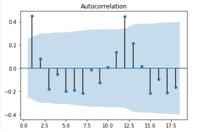

# Análise de Dados para Controle da Poluição

Este repositório contém uma análise de dados com Python e bibliotecas como Pandas, GeoPandas, Xarray, NumPy e Matplotlib para avaliar o impacto das emissões de gases tóxicos na qualidade do ar. Os dados, obtidos das plataformas MERRA-2 e EDGAR, abrangem emissões veiculares e queimadas agrícolas (ABW - Agricultural Waste Burning).

# Objetivo
O objetivo deste trabalho é identificar os impactos da poluição atmosférica no estado do Ceará, Região Nordeste do Brasil. A análise revelou que os cinco municípios com maiores concentrações de poluentes são:
📍 Cratéus
📍 Santa Quitéria
📍 Camindé
📍 Sobral
📍 Aquiarés

Além disso, as médias mensais de **Black Carbon (BC)** mostraram elevações significativas entre os meses de abril e agosto de 2015.

# 🛠️ Bibliotecas Utilizadas
*   **pandas** → Manipulação de DataFrames

*   **geopandas** → Manipulação e plotagem de dados georreferenciados

*   **xarray** → Importação e processamento de arquivos NetCDF

*   **numpy** → Manipulação de arrays e cálculos numéricos

*   **matplotlib.pyplot** → Visualização e plotagem de gráficos

# DESCRIÇÃO DOS RESULTADOS

Os resultados demonstram a influência das emissões de poluentes na qualidade do ar e podem auxiliar em estratégias de monitoramento ambiental e políticas públicas para controle da poluição.

    

        
    

  

*   O valor de **Beta** encontrado foi **1.0973**.
*   O valor de **Delta** encontrado foi **0.3308**.
*   O **risco relativo** foi de **1.4376**, com um **intervalo de confiança** entre **1.3587 e 1.5242**.
